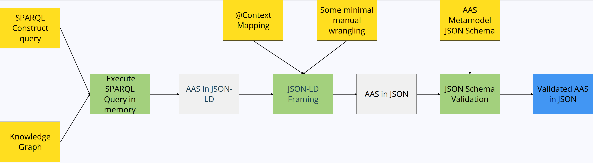

# Knowledge Graph to AAS Prototype

This repository is demonstrating a simple proof of concept for the transformation of a knowledge graph (KG) written in RDF (Resource Description Framework) - which can be formulated according to PMDCo (Platform Material Digital Core Ontology), EMMO (Elementary Multiperspective Materials Ontology) or other ontologies - to an Asset Administration Shell (AAS).

This repository **does not** contain modularized and packaged software, but more of a guideline how semantic technologies like **SPARQL** and **JSON LD** can be used to transform data models between both reference frameworks, TLOs (Top level ontologies) and AAS.

## 1. General workflow



As input we expecting the following implementations:

* The Knowledge graph expressed in OWL
* A SPARQL Construct Query
* A JSON LD Context Mapping
* Some minimal manual wrangling using REGEX, executed in a suitable programming language (e.g. Python) 
* The AAS Metamodel JSON Schema

Expected output:

* A validated AAS (serialized in JSON) with metadata from the input KG 

### 1.1 Prodcedure

#### 1.1.1 SPARQL Construct

#### 1.1.1.1 Setting up the query

The SPARQL query generally needs to have two parts:

* The WHERE-part, which is traversing nodes of the input KG in OWL and fetching the metadata to be reflected in the AAS (Lower part)
* The CONSTRUCT-part, which is setting up the AAS datamodel according to the official AAS metamodel ontology and the corresponding AAS template of interest (Upper part)

```{sparql}
CONSTRUCT {
  <The AAS model according to the template goes here>
}
WHERE {
  <The query for fetching metadata from the KG goes here>
}
```

The CONSTRUCT-part can be easily derived by transforming an `.aasx`-reference instance of the targeted `AAS`-template by using the `basyx-python-sdk` (`Experimental/Adapter/RDF`-sidebranch):

```{python}
import os
from basyx.aas import model
from basyx.aas.adapter.aasx import AASXReader, DictSupplementaryFileContainer
from basyx.aas.adapter.rdf import write_aas_rdf_file
from basyx.aas.adapter.json import write_aas_json_file

cwd = os.path.dirname(__file__)

aasx_path = os.path.join(cwd, "aas", "model.aasx")
json_path = os.path.join(cwd, "aas", "model.json")
ttl_path = os.path.join(cwd, "aas", "model.ttl")

objects = model.DictObjectStore()
files = DictSupplementaryFileContainer()
with AASXReader(aasx_path) as reader:
    metadata = reader.get_core_properties()
    reader.read_into(objects, files)

    write_aas_rdf_file(ttl_path, objects)
    write_aas_json_file(json_path, objects, indent=4)
```

The full `model.json`, `model.aasx`, `model.ttl` can be found under [examples/aas/model.json](examples/aas/model.json), [examples/aas/model.aasx](examples/aas/model.aasx) and [examples/aas/model.ttl](examples/aas/model.ttl). The executing script is available under [examples/extract_aas_model.py](examples/extract_aas_model.py).

The `model.ttl`-output from this script then contains the RDF-model of the AAS to be targeted by the SPARQL Constuct Query. 
See the following snippet as example:

```{turtle}
...

[ 
    a aas:Property ;
    ns6:semanticId [ a aas:Reference ;
            ns1:keys [ a aas:Key ;
                    ns4:type <https://admin-shell.io/aas/3/0/KeyTypes/GlobalReference> ;
                    ns4:value "https://admin-shell.io/idta/InspectionDocumentsOfSteelProducts/TensileStrengthMean/1/0"^^xsd:string ] ;
            ns1:type <https://admin-shell.io/aas/3/0/ReferenceTypes/ExternalReference> ] ;
    ns13:valueType <https://admin-shell.io/aas/3/0/DataTypeDefXsd/xs:float> ;
    ns14:qualifiers [ a aas:Qualifier ;
            ns6:semanticId [ a aas:Reference ;
                    ns1:keys [ a aas:Key ;
                            ns4:type <https://admin-shell.io/aas/3/0/KeyTypes/GlobalReference> ;
                            ns4:value "https://admin-shell.io/SubmodelTemplates/Cardinality/1/0"^^xsd:string ] ;
                    ns1:type <https://admin-shell.io/aas/3/0/ReferenceTypes/ExternalReference> ] ;
            ns8:kind <https://admin-shell.io/aas/3/0/QualifierKind/TemplateQualifier> ;
            ns8:type "SMT/Cardinality"^^xsd:string ;
            ns8:value "ZeroToOne"^^xsd:string ;
            ns8:valueType <https://admin-shell.io/aas/3/0/DataTypeDefXsd/xs:string> ] ;
    ns5:displayName [ a aas:LangStringNameType ;
            ns3:language "en"^^xsd:string ;
            ns3:text "Tensile Strength Mean"^^xsd:string ],
        [ a aas:LangStringNameType ;
            ns3:language "de"^^xsd:string ;
            ns3:text "Zugfestigkeit Mittelwert"^^xsd:string ] ;
    ns5:idShort "TensileStrengthMean"^^xsd:string ,
    aas:Property/value ?tensile_strength
],

...
```

One now simply needs to exchange the hardcoded values of the AAS-instance with variables which are originating from the WHERE-part (with the knowledge graph to be queried). For this, please note the very last line with `aas:Property/value ?tensile_strength`, which contains the `?tensile_strength`-variable to be manually inserted instead of an originally hardcoded value such as e.g. `aas:Property/value "784.094"^xsd:float`.

After inserting this model with the variables into the CONSTRUCT-part, the WHERE-part needs to be defined.

Lets consider a very simple knowledge graph with a couple of entities:

```turtle
fileid:ModulusOfElasticity a <https://w3id.org/steel/ProcessOntology/ModulusOfElasticity> ;
    qudt:hasUnit "http://qudt.org/vocab/unit/MegaPA"^^xsd:anyURI ;
    qudt:value "208997.842"^^xsd:float .

fileid:PoissonRatio a <https://w3id.org/steel/ProcessOntology/PoissonRatio> ;
    qudt:hasUnit "http://qudt.org/vocab/unit/NUM"^^xsd:anyURI ;
    qudt:value "0.3"^^xsd:float .

fileid:ProofStrength_0.2Percentage a <https://w3id.org/steel/ProcessOntology/ProofStrength_0.2Percentage> ;
    qudt:hasUnit "http://qudt.org/vocab/unit/MegaPA"^^xsd:anyURI ;
    qudt:value "509.255"^^xsd:float .

fileid:TensileStrength a <https://w3id.org/steel/ProcessOntology/TensileStrength> ;
    qudt:hasUnit "http://qudt.org/vocab/unit/MegaPA"^^xsd:anyURI ;
    qudt:value "782.094"^^xsd:float .

```

The full file can be found under [examples/input/test.ttl](examples/input/test.ttl).

These mechanical properties can be semantically described within a characterization process according to a suitable ontology, such as PMDCo.

In order to extract the needed `?tensile_strength` for the AAS from this KG, we can simply write the following WHERE-part for our SPARQL Query:

```{turtle}
fileid:TensileStrength a <https://w3id.org/steel/ProcessOntology/TensileStrength> ;
                       qudt:value ?tensile_strength .
```

The full mapping expressed by the SPARQL Construct can be found under [examples/input/mapping.sparql](examples/input/mapping.sparql).

#### 1.1.1.2 Executing the query

By using any SPARQL Engine in reference implementations like RDFLib, pyoxigraph, etc. and the SPARQL Construct defined in the previous section, we can transform the KG model into the AAS model we have defined in the query.

```{python}
import json
from rdflib import Graph

g = rdflib.Graph()
g.parse(<your-input-kg>)

result = g.query(<your-sparql-construct>).serialize(format="json-ld")
json_ld = json.loads(result)
```

The output is an AAS serialized in JSON-LD.

#### 1.1.2 JSON LD Framing

The JSON LD context is used for framing the resulting AAS in JSON LD from the previous step into the official AAS JSON Schema according. 

An extraction of an example context may look like this:

```{json}
{
  "@context": {
    "aas": "https://admin-shell.io/aas/3/0/",
    "xs": "http://www.w3.org/2001/XMLSchema#",
    "aas:value": {
        "@type": "xs:float"
    },
    "idShort": "aas:Referable/idShort",
    "modelType": {
      "@id": "@type",
      "@type": "@vocab"
    },
    "id": "aas:Identifiable/id",
    "kind": {
      "@id": "aas:HasKind/kind",
      "@type": "@vocab"
    },
    
    "qualifiers": {
      "@id": "aas:Qualifiable/qualifiers",
      "@container": "@set",
      "@context": {
        "semanticId": {
          "@id": "aas:HasSemantics/semanticId",
          "@context": {
            "type": {
              "@id": "aas:Reference/type",
              "@type": "@vocab"
            },
            "keys": {
              ...
              }
            }
          }
        }
      }

    ...

    }
```

We are working here with global and local `@contexts` in the frame, since the official AAS Json Schema is expecting keys like `value`, `type` or `valueType` in multiple objects like `Property`, `Referable` and `Qualifier`, which are expressed through different IRIs in the different contexts, such as `aas:Property/value`, `aas:Property/valueType`, `aas:Qualifier/valueType`, `aas:Qualifier/value`, etc.

The framing can be executed by using the `pyld` library in the following code snippet:

```{python}
from pyld import jsonld

json_ld = jsonld.frame(json_ld, frame)
output = jsonld.compact(json_ld, frame["@context"])
```

Depending on how well the `@context` is defined, the framing still might not lead to a JSON body, which is 100%-ly following the AAS JSON Schema. 

The current frame we have provided in this repository has issues with resolving the IRIs properly in the global and the local context hence, there still will be keys like `aas:Property/value` in the framed JSON document, which are not compliant to the AAS JSON Schema.

This leads to the current need to perfrom small operations like string replacement using REGEX and array filtering. 

At the moment, it is solved like this:

```{python}
import re
import json

# replace strings according to regex patterns
patterns = [ r'"aas:[^/"]+/([^/"]+)"', r'"aas:([^/"]+)"' ]
result = json.dumps(output,indent=2)
for pattern in patterns:
    result = re.sub(pattern["regex"], r'"\1"', result)
output = json.loads(result)

# get submodel node
for node in output["@graph"]:
    node_type = node.get("@type")
    if node_type == target_type:
        output = node
        break

```

### 1.1.3 JSON Schema validation

In order to make sure that the JSON body after framing is compliant to the AAS metamodel schema, we are applying a schema validation of our document against the official [AAS JSON Schema](https://raw.githubusercontent.com/admin-shell-io/aas-specs/refs/heads/master/schemas/json/aas.json). We can do this by using the JSON-Schema library in Python:

```{python}
import requests
from jsonschema import validate

aas_json_schema = "https://raw.githubusercontent.com/admin-shell-io/aas-specs/refs/heads/master/schemas/json/aas.json"

validate(output, requests.get(aas_json_schema).json())
```

If no error if thrown, the JSON document should be compliant towards the standard. However, the validation is expecting that the top-level object is an `AssetAdministrationShell`, not any other type like `Submodel`, `SubmodelElementCollection`, etc. since they **MUST** be embedded into the `AssetAdministrationShell`-Object.

## 2. Requirements

The requirements can be installed simply by `pip install -r requirements.txt`.

The list of packages is the following:

```
rdflib>=7,<8
PyLD>=2,<2.1
jsonschema>=4.25.0,<5
requests
git+https://github.com/eclipse-basyx/basyx-python-sdk.git@6bd05e54fbe6c78b30dd0926a37f8741a64d42ca
```

## 3. License

This project is licensed under the BSD 3-Clause. See the LICENSE file for more information.


## 4. Disclaimer

Copyright (c) 2014-2024, Fraunhofer-Gesellschaft zur Förderung der angewandten Forschung e.V. acting on behalf of its Fraunhofer IWM.

Contact: [Matthias Büschelberger](mailto:matthias.bueschelberger@iwm.fraunhofer.de)
